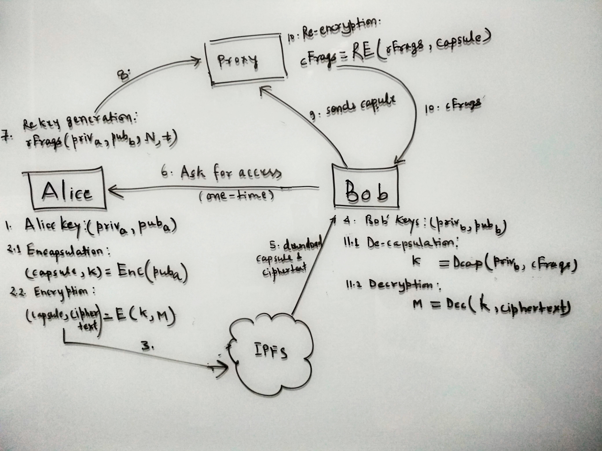

## WHAT?

Proxy re-encryption is a set of algorithms which allows an untrusted proxy to transform ciphertext (homomorphic encryption) from being encrypted under one key to another, without learning anything about the underlying plaintext.

## BIGGER PICTURE

- file sharing use case (m-to-m)
- group chat use case
- EHR use case

## HOW DOES IT WORKS




## Threshold Proxy-Re-Encryption 

```

---------------------------------------------------------------------------------------------
|                pka     M                    ska     pkb     N       T   t                 |
|                |       |                    |       |       |       |   |                 |
|                |       |                    ----------------------------- REKEY GENERATION|
|                |       |                                  |                               |
|                |       |                                  |                               |
|ENCAPSULATION-------    |                                  |                               | 
|            |      |    |                                  |                               | ALICE
|        Capsule    K    |                              {kFrag}(1 to N)                     |
|            |      |    |                                  |                               |
|            |      ------ ENCRYPTION                       |                               |
|            |         |                                    |                               | 
|            |         |                                    |                               |
|            |        EncM                                  |                               |
|            |         |                                    |                               |
-------------|---------|------------------------------------|-------------------------------       
             |         |          ----------------------------|------------------  
             |         |        |                           |                 |
             ----------|--------|-------                    |                 |
                       |        |      |                    |                 |  PROXY
                       |        |      ---------------------- RE-ENCRYPTION   |
                       |        |               |                             |
                       |        |               |                             |  
                       |        |       {cFrag}(1 to t)                       |
                       |        |               |                             |
                       |        ----------------|----------------------------- 
                       |                        |                                              
                       |                        |                      
                    ----------------------------|------------------------------------------
                    |  |                        |                      skb
                    |  |                        |                       |                 |
                    |  |                        ------------------------- DECAPSULATION   |
                    |  |                           |                                      |
                    |  |                           |                                      | BOB
                    |  |                           K                                      |
                    |  |                           |                                      | 
                    |  |                           |                                      |
                    |  ---------------------------- DECRYPTION                            |
                    |                |                                                    |
                    |                |                                                    |
                    |               [M]                                                   |
                    -----------------------------------------------------------------------


```

Where,
 - pka, ska : public-secret key pair of Alice
 - pkb, skb : public-secret key pair of Bob
 - EncM     : Encrypted Meessage
 - K        : Symmetric key
 - N        : Number of fragments
 - t        : threshhold
 - {kFrag (1 to N)} : set of N fragments of re-key
 - {cFrag (1 to t)} : set of t fragments of capsule

## ALGOS

- ECIES
- AFGH
- BBS98

## WHYS?

- Why not simply use public key to encrypt the message rather than using a third key (symmetric key)?
- Why to send the rekey to proxy, why not Alice did the re-encryption on her own ?
- Where do we think Blockchain fits in here? 


## TYPES

**bi-directional**

  - that it is possible to compute re(b->a) from just re(a->b)
  - re-encryption key can be used to translate messages from Bob to Charlie, as well as from Charlie to Bob.
  - rekey is generated : re(a<->b = rekey(ska , skb)
  - Interactive (BBS98, ESIES)

**uni-directional**

  - In uni-directional algorithms that is impossible
  - rekey is generated : re(a<->b = rekey(ska , pkb)
  - Non interactive (AFGH)
 
## RFERENCES

- [my blog](https://blog.imaginea.com/nucypher-proxy-re-encryption/)
- [PRE wikki](https://en.wikipedia.org/wiki/Proxy_re-encryption)
- [Umbral Doc](https://github.com/nucypher/umbral-doc/blob/master/umbral-doc.pdf)
- [Umbral python implementation - pyUmbral doc](https://pyumbral.readthedocs.io/en/latest/index.html)

- [Umbral python implementation - pyUmbral github](https://github.com/nucypher/pyUmbral)
- [Talk of Prof. Michael Egorov](https://www.youtube.com/watch?v=2hpmavFGz9Y&t=730s)


